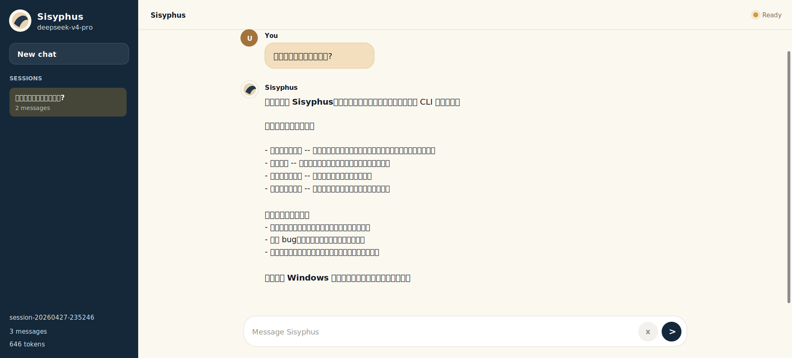

# Sisyphus

<p align="center">
  <strong>一个用 Go 编写的本地 AI 编码助手。</strong>
</p>

<p align="center">
  <a href="#快速开始">快速开始</a>
  ·
  <a href="#运行模式">运行模式</a>
  ·
  <a href="#配置">配置</a>
  ·
  <a href="#项目结构">项目结构</a>
</p>

<p align="center">
  
  
  
  
</p>

Sisyphus 是一个面向日常开发工作的 AI Agent。它把大模型、短期记忆、任务队列、内置工具、MCP 扩展和本地 Web UI 串在一起，让模型能够读项目、搜代码、改文件、跑命令，并把一次次对话保存为可恢复的 session。



## 功能亮点

- **本地优先**：配置、会话历史和工具执行都在本机完成，适合直接接入自己的开发目录。
- **多种入口**：支持一次性任务、交互式 REPL 和浏览器 Web UI。
- **工具调用**：内置 shell、文件读写、精确编辑、目录遍历、代码搜索和 Tavily web search。
- **MCP 扩展**：可以通过配置文件接入 filesystem、GitHub 等外部 MCP server。
- **会话持久化**：对话会保存为 JSON session，可在 CLI 或 Web UI 中继续加载。
- **跨平台**：Windows、Linux、macOS 使用同一套 Go 代码和平台适配配置路径。

## 快速开始

```powershell
go build -o bin\sisyphus.exe .\cmd\sisyphus
Copy-Item config.yaml.example config.yaml
```

设置模型密钥：

```powershell
$env:DEEPSEEK_API_KEY="sk-..."
```

启动本地 Web UI：

```powershell
.\bin\sisyphus.exe web --addr 127.0.0.1:7357
```

然后打开：

```text
http://127.0.0.1:7357
```

Linux/macOS：

```bash
go build -o bin/sisyphus ./cmd/sisyphus
cp config.yaml.example config.yaml
export DEEPSEEK_API_KEY="sk-..."
./bin/sisyphus web --addr 127.0.0.1:7357
```

## 运行模式

### Web UI

```powershell
.\bin\sisyphus.exe web
```

默认监听 `127.0.0.1:7357`。可以用 `--addr` 修改地址：

```powershell
.\bin\sisyphus.exe web --addr 127.0.0.1:8080
```

Web UI 会显示当前 session、历史会话、消息数、token 数和流式输出状态。

### 交互式 REPL

```powershell
.\bin\sisyphus.exe
```

常用命令：

```text
/help              显示帮助
/save [name]       保存当前会话
/load <name>       加载已保存会话
/sessions          列出所有会话
/tools             查看已注册工具
/memory            查看消息数、token 数和当前 session
/clear             清空记忆并开始新会话
/exit              退出
```

### 一次性任务

```powershell
.\bin\sisyphus.exe --instruction "列出当前目录下所有 Go 文件，并说明每个包的用途"
```

一次性任务会提交到内部任务队列，执行完成后输出结果并退出。

## 配置

仓库只提交脱敏后的 [config.yaml.example](./config.yaml.example)。本地真实配置文件使用 `config.yaml`，该文件已被 `.gitignore` 忽略，避免把 API key、本机路径等敏感信息提交到 git。

配置文件搜索顺序：

1. `SISYPHUS_CONFIG` 指定的路径
2. 当前工作目录下的 `config.yaml`
3. 可执行文件所在目录下的 `config.yaml`
4. Linux/macOS: `$XDG_CONFIG_HOME/sisyphus/config.yaml`
5. Linux/macOS: `~/.config/sisyphus/config.yaml`
6. Linux/macOS: `/etc/sisyphus/config.yaml`
7. Windows: `%APPDATA%\sisyphus\config.yaml`
8. Windows: `%ProgramData%\sisyphus\config.yaml`

默认示例使用 DeepSeek：

```yaml
llm:
  provider: deepseek
  model: deepseek-v4-pro
  base_url: https://api.deepseek.com
  api_key: ${DEEPSEEK_API_KEY}
  max_tokens: 8192
  temperature: 0.0
  timeout: 120
```

如需使用 OpenAI 或其它 OpenAI 兼容服务，调整 `provider`、`model`、`base_url` 和 API key 即可。

## 环境变量

| 变量 | 说明 |
|---|---|
| `DEEPSEEK_API_KEY` | DeepSeek provider 的 API key |
| `OPENAI_API_KEY` | OpenAI provider 的 API key，也会覆盖配置中的 `llm.api_key` |
| `TAVILY_API_KEY` | Tavily web search API key |
| `SISYPHUS_CONFIG` | 显式指定配置文件路径 |
| `SISYPHUS_DATA_DIR` | 显式指定会话和本地数据目录 |
| `SISYPHUS_MODEL` | 覆盖配置中的模型名 |
| `SISYPHUS_MAX_STEPS` | 覆盖单任务最大步数 |
| `SISYPHUS_WORKERS` | 覆盖任务队列 worker 数量 |
| `SISYPHUS_BASH_TIMEOUT` | 覆盖 bash 工具超时时间，单位秒 |
| `SISYPHUS_WEB_SEARCH_ENDPOINT` | 覆盖 web search endpoint |
| `SISYPHUS_WORKSPACE` | 示例 MCP filesystem server 使用的工作目录占位变量 |

## 会话历史

Sisyphus 会把对话历史保存为 JSON 文件：

```text
<SISYPHUS_DATA_DIR>/sessions/session-*.json
```

如果没有设置 `SISYPHUS_DATA_DIR`，默认路径是：

```text
Windows: %LOCALAPPDATA%\sisyphus\sessions
Linux/macOS: ~/.local/share/sisyphus/sessions
```

可以用 `--session` 恢复指定会话：

```powershell
.\bin\sisyphus.exe web --session session-20260427-235246
.\bin\sisyphus.exe --session session-20260427-235246
```

## MCP 与工具

`config.yaml.example` 中已经包含两个 MCP 示例：

- `filesystem`：默认启用，通过 `SISYPHUS_WORKSPACE` 指定可访问目录。
- `github`：默认关闭，配置 `GITHUB_TOKEN` 后可启用。

内置工具可以通过 `tools.enabled` 和 `tools.disabled` 控制。默认示例启用了：

```text
bash, read_file, write_file, edit_file, list_files, search
```

如果需要 web search，请配置 `TAVILY_API_KEY`，并把 `web_search` 加入启用列表。

## 命令行参数

```text
sisyphus [flags]
sisyphus web [--addr 127.0.0.1:7357]

--instruction  Task instruction to run (single-shot mode)
--session      Restore a saved interactive session
--config       Path to config file
--debug        Print verbose debug output
--trace-raw    Include raw model reasoning in REPL trace output
--trace-json   Emit REPL trace events as JSONL
```

Web UI 子命令支持：

```text
--addr     Address for the local web UI
--session  Restore a saved interactive session by ID
--config   Path to config file
--debug    Print verbose debug output
```

## 项目结构

```text
cmd/sisyphus        CLI 入口和 Web UI 子命令
internal/agent     Agent 执行循环、提示词和流式 step
internal/llm       OpenAI/DeepSeek 兼容 provider
internal/mcp       MCP client、工具适配和进程管理
internal/memory    对话记忆、token 裁剪和 session JSON 持久化
internal/repl      交互式命令行界面
internal/task      任务队列和 worker pool
internal/tool      工具接口、注册表和内置工具
internal/webui     本地浏览器 UI、SSE 流式事件和静态资源
pkg/config         配置加载、环境变量覆盖和数据目录解析
```

## 开发命令

Windows PowerShell：

```powershell
go test ./...
go vet ./...
go build -o bin\sisyphus.exe .\cmd\sisyphus
```

Linux/macOS：

```bash
go test ./...
go vet ./...
go build -o bin/sisyphus ./cmd/sisyphus
```

跨平台编译：

```bash
GOOS=linux GOARCH=amd64 go build -o bin/sisyphus-linux-amd64 ./cmd/sisyphus
GOOS=darwin GOARCH=amd64 go build -o bin/sisyphus-darwin-amd64 ./cmd/sisyphus
GOOS=windows GOARCH=amd64 go build -o bin/sisyphus-windows-amd64.exe ./cmd/sisyphus
```

## 设计要点

- Agent 每轮先让模型生成回复或工具调用，再把工具结果写回 memory。
- Memory 会按消息数和 token 数自动裁剪，并尽量保留工具调用结构完整。
- REPL 和 Web UI 共用同一套 agent、memory、tool registry 和 session manager。
- MCP server 以独立进程启动，工具会被适配成本地统一 `tool.Tool` 接口。
- SIGINT/SIGTERM 会触发 graceful shutdown，取消运行中的任务并关闭 MCP 进程。

## License

MIT
